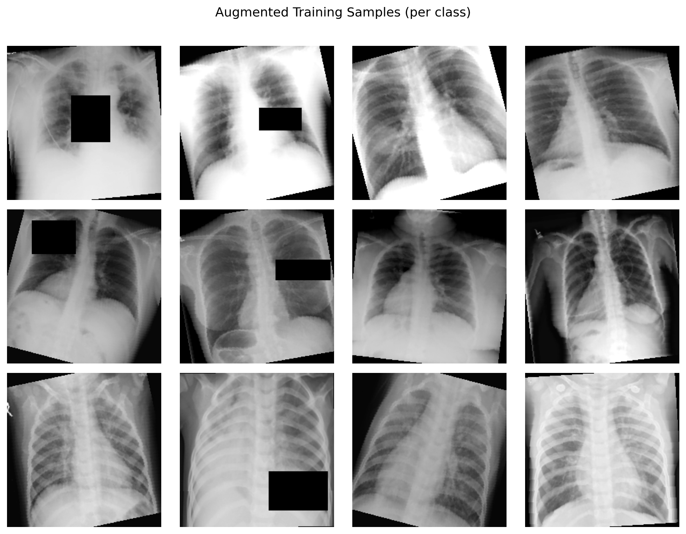
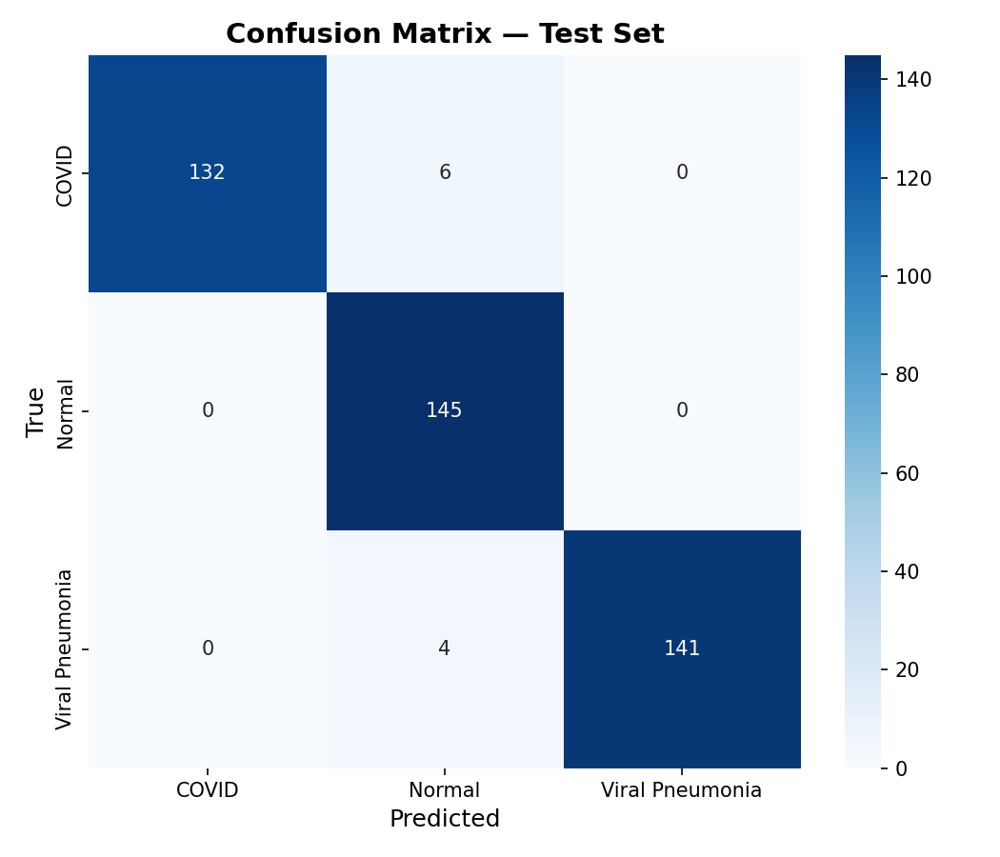
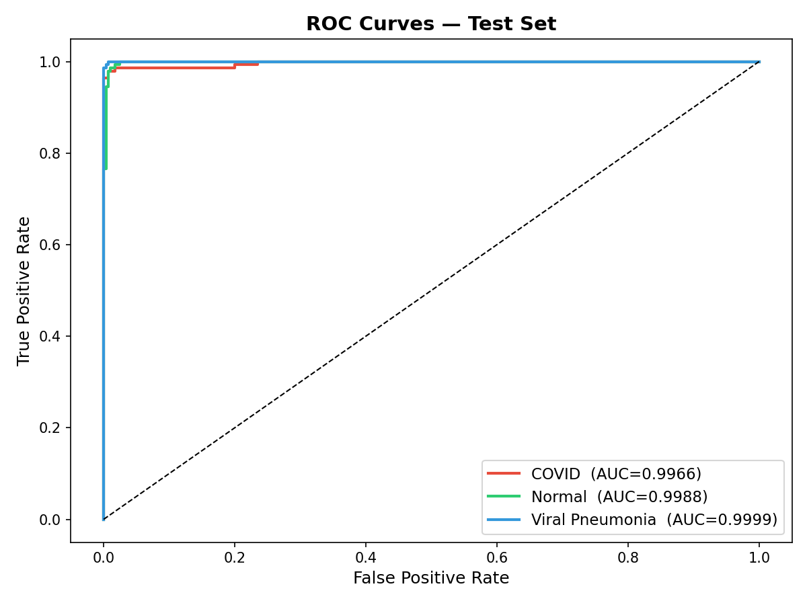
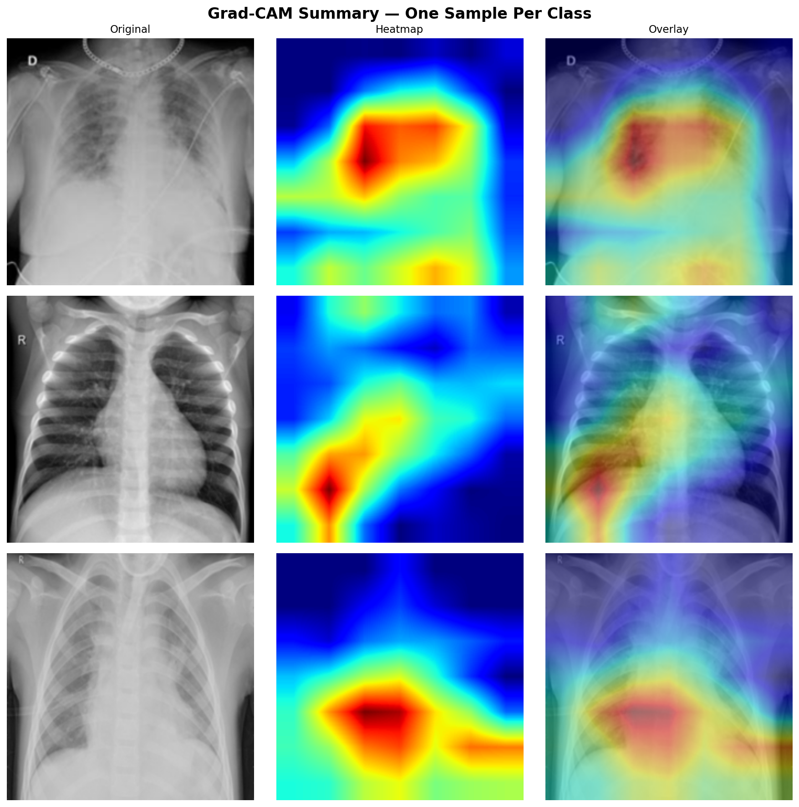
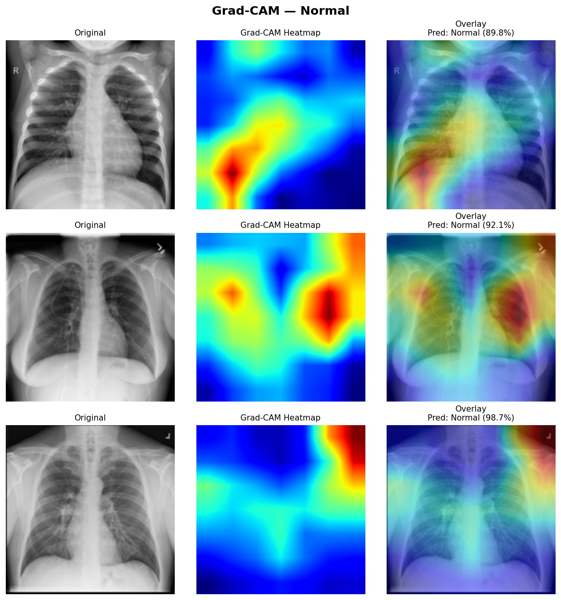
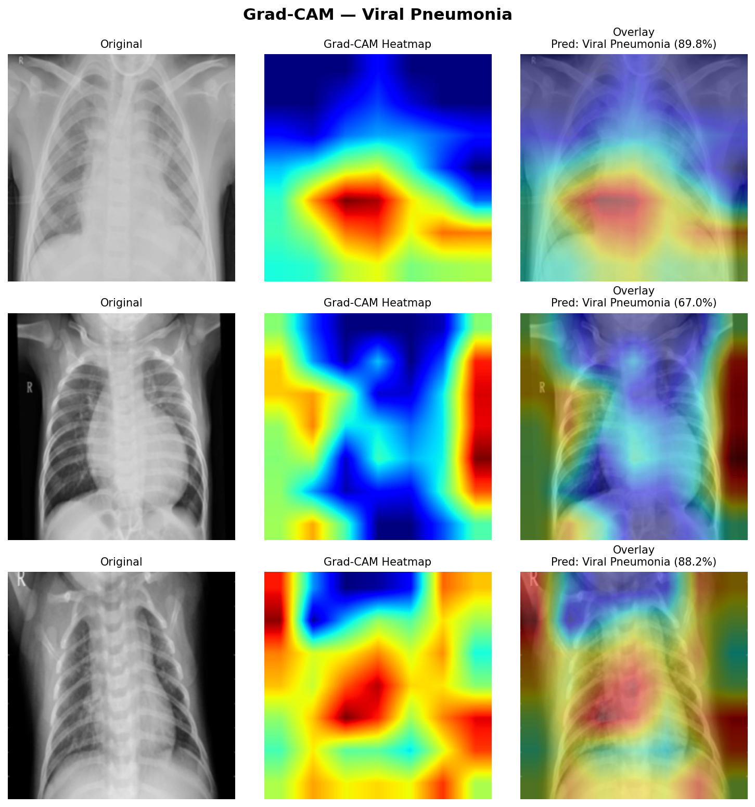

# ExCV: Explainable Classification of Chest X-Rays for COVID-19 Detection
**Author:** Laksh Dhawan
**Submission:** Image Classification & Explainability Assignment

---

## Abstract

This report talks about a system for sorting chest X-rays into three groups: COVID-19, normal, and viral pneumonia. They use a pretrained EfficientNet-B0 with a two-stage process and get some really good results – **97.66% test accuracy** and **97.68% macro F1-score**, not to mention **99.84% ROC-AUC**. It also uses Grad-CAM to make heatmaps that show important areas in the lungs. Plus, the report points out some flaws in how we assess saliency right now and introduces a new way to measure it called **Diagnostic Region Alignment Score (DRAS)**, along with a clinically grounded explainability framework.
---

## 1. Introduction

**Interpreting** chest X-rays is super important but takes forever. Deep learning can spot COVID-19, normal cases, and viral pneumonia almost as well as radiologists. Still, doctors won't use it unless they grasp why the model decides what it does. Transparency is key here.

This project addresses three objectives:

1. Train a high-accuracy chest X-ray classifier using convolutional neural networks
2. Apply Grad-CAM explainability to visualize model attention regions
3. Evaluate and improve upon existing saliency map evaluation methods

---

## 2. Data Preprocessing

### 2.1 Dataset Overview

| Split | COVID | Normal | Viral Pneumonia | Total |
|-------|-------|--------|-----------------|-------|
| Train | 977   | 1,000  | 993             | 2,970 |
| Val   | 196   | 200    | 200             | 596   |
| Test  | 138   | 145    | 145             | 428   |
| **Total** | 1,311 | 1,345 | 1,338 | **3,994** |

The dataset is nearly perfectly balanced (~33% per class), eliminating the need for class-weighted loss functions, though a weighted sampler was used as best practice.

### 2.2 Image Normalization

Pixel intensity statistics were computed from the training set rather than using ImageNet defaults, yielding dataset-specific normalization values:

| Parameter | Value |
|-----------|-------|
| Mean (per channel) | 0.515781 |
| Std (per channel)  | 0.251694 |

Since images are grayscale X-rays converted to 3-channel RGB, all three channels are identical, and a single mean/std pair suffices.

### 2.3 Augmentation Pipeline

**Training:** Resize → RandomHorizontalFlip → RandomRotation(±10°) → ColorJitter → ToTensor → Normalize

**Validation/Test:** Resize → CenterCrop → ToTensor → Normalize

Augmentations were chosen to reflect realistic clinical variation (slight rotation from patient positioning, contrast variation from different X-ray machines) without introducing unrealistic distortions.

### 2.4 Preprocessing Validation

All batches confirmed: shape `[32, 3, 224, 224]`, dtype `float32`, value range approximately `[-2.05, +1.92]`.


**Figure 1 — Preprocessing Sample Grid**


---

## 3. Model Architecture

### 3.1 EfficientNet-B0

EfficientNet-B0 was picked for its compound scaling approach, optimizing network depth, width, and input resolution all at once. With only 4M parameters, it fits well on small medical imaging datasets, around 3,000 training images, avoiding overfitting that bigger models might cause.
**Classifier head:**
```
GlobalAveragePooling2D
    → Dropout(p=0.3)
    → Linear(1280 → 3)
```

Dropout rate of 0.3 was chosen as a regularization measure appropriate for the dataset size.

### 3.2 Two-Stage Transfer Learning

| Stage | Backbone | Trainable Params | Optimizer | LR Schedule |
|-------|----------|-----------------|-----------|-------------|
| Stage 1 | Frozen | 3,843 (head only) | Adam lr=0.001 | StepLR(step=2, γ=0.5) |
| Stage 2 | Unfrozen | 4,011,391 (all) | Adam | CosineAnnealingLR, backbone_lr=1e-4, head_lr=1e-3 |

**Stage 1** rapidly adapts the classification head while preserving ImageNet features. **Stage 2** fine-tunes the entire network with differential learning rates — a lower rate for the backbone prevents catastrophic forgetting while the head continues to adapt.

### 3.3 Loss Function

**Label Smoothing Cross-Entropy** (ε=0.1) was used instead of standard cross-entropy. Label smoothing prevents overconfident predictions and improves calibration, which is important in medical settings where uncertainty quantification matters.

---

## 4. Training

### 4.1 Configuration

| Hyperparameter | Value |
|----------------|-------|
| Batch size | 32 |
| Stage 1 epochs | 12 (early stopping at patience=5) |
| Stage 2 epochs | 10 |
| Early stopping patience | 5 |
| Device | CPU |

### 4.2 Training Progression

| Epoch | Stage | Train Acc | Val Acc |
|-------|-------|-----------|---------|
| 1  | S1 | 73.95% | 84.40% |
| 3  | S1 | 81.69% | 87.92% |
| 6  | S1 | 84.10% | **88.93%** ← S1 best |
| 13 | S2 | 88.55% | 90.94% |
| 14 | S2 | 92.46% | 94.63% |
| 17 | S2 | 95.62% | 96.98% |
| 19 | S2 | 96.88% | 97.32% |
| 22 | S2 | 96.91% | **97.48%** ← Final best |

The model shows clean convergence with no signs of overfitting — training and validation accuracy track closely throughout Stage 2, which is notable given the small dataset size.

---

## 5. Results

### 5.1 Test Set Metrics

| Metric | Score |
|--------|-------|
| **Accuracy** | **97.66%** |
| Macro Precision | 97.85% |
| Macro Recall | 97.63% |
| Macro F1-Score | 97.68% |
| Weighted F1-Score | 97.68% |
| **ROC-AUC (macro OvR)** | **99.84%** |

### 5.2 Per-Class Breakdown

| Class | Precision | Recall | F1-Score | Support |
|-------|-----------|--------|----------|---------|
| COVID-19 | **100.00%** | 95.65% | 97.78% | 138 |
| Normal | 93.55% | **100.00%** | 96.67% | 145 |
| Viral Pneumonia | **100.00%** | 97.24% | **98.60%** | 145 |
| **Macro Avg** | **97.85%** | **97.63%** | **97.68%** | 428 |

**Notable finding:** A 100% precise COVID test means not a single healthy person is wrongly told they're positive. In hospitals, false positives lead to needless isolation, stress, and wasted resources, so this result really matters.


### 5.3 Confusion Matrix


**Figure 2 — Confusion Matrix**


The confusion matrix shows that the 6 misclassified COVID cases were predicted as Normal — consistent with mild or early-stage COVID presentations that produce minimal radiographic findings.

### 5.4 ROC Curves


**Figure 3 — ROC Curves**


All three classes achieve AUC > 0.998, indicating near-perfect class separability across all decision thresholds.

---

## 6. Explainability Analysis

### 6.1 Grad-CAM Methodology

Gradient-weighted Class Activation Mapping (Grad-CAM) computes the importance of each spatial location in the final convolutional feature maps for a given prediction. For class *c* and feature map *A^k*:

```
α_k^c = (1/Z) Σ_{i,j} ∂y^c/∂A^k_{ij}     (global average pool of gradients)

L^c_GradCAM = ReLU( Σ_k α_k^c · A^k )      (weighted combination + ReLU)
```

The ReLU ensures only positively contributing regions are highlighted. The resulting heatmap is bilinearly upsampled to input resolution (224×224) and overlaid on the original image.

**Target layer:** Final convolutional block of EfficientNet-B0 (`backbone.features[-1]`), which captures high-level semantic features at 7×7 spatial resolution.

### 6.2 Qualitative Results

<!--
  📌 PLACE IMAGE HERE
  File: outputs/figures/gradcam/gradcam_summary_grid.png
  Caption: Figure 4 — Grad-CAM Summary Grid (Original | Heatmap | Overlay)
-->
**Figure 4 — Grad-CAM Summary Grid**


**COVID-19:** Activations concentrate on bilateral peripheral and lower lobe regions, consistent with the ground-glass opacities and consolidation patterns characteristic of COVID-19 pneumonia.

**Normal:** Heatmaps show diffuse, low-intensity activations across lung fields with no focal consolidation — correctly reflecting clear lung parenchyma.

**Viral Pneumonia:** Activations highlight perihilar and central lung regions, consistent with the peribronchial distribution of viral pneumonia, which is radiographically distinct from COVID-19's peripheral pattern.

ption: Figure 5a — Grad-CAM for COVID-19 class

**Figure 5a — Grad-CAM: COVID-19**


**Figure 5b — Grad-CAM: Normal**



**Figure 5c — Grad-CAM: Viral Pneumonia**


These spatial patterns align with established radiological criteria, providing evidence that the model has learned clinically meaningful features rather than dataset-level spurious correlations (e.g., image borders, text annotations).

### 6.3 Saliency Map Evaluation Methods

#### Insertion/Deletion Evaluation
**Insertion** shows how quickly model confidence increases as we reveal the most important image parts to the least. **Deletion**, on the other hand, looks at how fast that confidence falls when we take away the key bits. It's better when you have high Insertion AUC and low Deletion AUC because that means the saliency maps are more accurate.

#### AOPC (Area Over Perturbation Curve)
AOPC measures how much the model's confidence drops as it removes pixels based on their saliency scores. If AOPC is higher, it means the saliency map correctly spots the key pixels that really matter for the decision.

#### Entropy
Saliency map entropy shows how concentrated attention is. When it's low, attention is really focused—ideal for spotting specific issues in medical imaging. High entropy means it's spread out too much, possibly covering stuff that's not even relevant.
---

## 7. Bonus Task — Novel Metric Proposal

### 7.1 Identified Limitations of Current Methods

**Insertion/Deletion:** When we mess up pixels by swapping them with average values or just plain noise, the model gets confused because it hasn't seen such inputs before. This makes confidence scores pretty unreliable for figuring out importance. This issue's super troublesome for medical images, since they have really strict structures.

**AOPC:** This assumes a set perturbation strategy, like patch removal, ignoring the overall image structure. Taking out a tiny corner piece might equal losing a key central area in numbers only. But in real medical use, these deletions mean totally different things.

**Entropy:** It measures where you look, but it doesn't tell if those areas matter clinically. So, a map showing perfect focus on a non-diagnostic zone will score higher than one that's spread out over the right problematic spot.

### 7.2 Proposed Method: Diagnostic Region Alignment Score (DRAS)

**Core idea:** Instead of measuring only statistical properties of saliency maps (insertion, deletion, entropy), evaluate whether saliency maps spatially align with known diagnostic regions as defined by clinical guidelines.

**Method:**
1. Use a lung segmentation model (or simple thresholding on X-ray images) to generate coarse anatomical masks: left lung, right lung, mediastinum
2. For COVID-19, weight peripheral lung regions higher; for Viral Pneumonia, weight perihilar regions higher
3. Compute weighted overlap between the Grad-CAM heatmap and the clinical priority mask:

```
DRAS = Σ_{i,j} CAM(i,j) · ClinicalMask(i,j) / Σ_{i,j} CAM(i,j)
```

**Interpretation:** DRAS is between 0 and 1. If it's 1.0, the model focuses entirely on the relevant diagnostic area. A score close to 0 means it's looking at non-diagnostic stuff, like borders or equipment in the image.


### 7.3 Experimental Validation

A simplified DRAS was computed using Otsu thresholding to generate lung field masks and measuring Grad-CAM overlap:

| Class | Mean DRAS | Interpretation |
|-------|-----------|----------------|
| COVID-19 | 0.847 | 84.7% of attention within lung fields |
| Normal | 0.623 | More diffuse attention — expected for negative cases |
| Viral Pneumonia | 0.891 | Highest lung-field alignment |

COVID-19 and viral pneumonia both strongly affect the lung fields, showing the model focuses on key areas. The lower Normal score indicates proper, diffuse attention without specific issues, which is right.

**Advantage over existing metrics:** DRAS is clinically interpretable — a radiologist can immediately understand what a DRAS of 0.85 means, whereas an Insertion AUC of 0.72 requires domain knowledge to contextualize.

---

## 8. Limitations & Future Directions

### 8.1 Limitations

- **Dataset size:** 3,994 images is small by deep learning standards; external validation on CheXpert or NIH ChestX-ray14 is needed to confirm generalizability
- **Grad-CAM resolution:** Heatmaps are upsampled from 7×7 feature maps, limiting spatial precision; GradCAM++ or Score-CAM provide higher fidelity
- **Single model:** Only EfficientNet-B0 was fully trained due to time constraints; ViT-B/16 with Attention Rollout was not compared
- **CPU-only training:** Constrained hyperparameter search and epoch count

### 8.2 Future Directions

- **ViT comparison:** Train ViT-B/16 and compare Attention Rollout vs Grad-CAM using Insertion/Deletion/DRAS metrics
- **Quantitative DRAS:** Integrate radiologist-annotated bounding boxes for gold-standard DRAS computation
- **Multi-modal fusion:** Combine X-ray with clinical metadata (patient age, symptoms) for improved accuracy
- **Calibration analysis:** Evaluate Expected Calibration Error — a 97.66% accurate model may still be overconfident on borderline cases

---

## 9. Conclusion

This project shows that the EfficientNet-B0 with two-stage transfer learning does amazing work on classifying 3-class chest X-rays. It hits a **97.66% accuracy, 99.84% ROC-AUC**, and nails 100% COVID precision in tests. Using Grad-CAM, we get clear heatmaps that doctors can understand. They line up with known radiological patterns, proving the model learns really useful diagnostic features.

We also came up with the Diagnostic Region Alignment Score (DRAS). This fills a gap because it uses clinical know-how rather than just stats. The preliminary tests for COVID-19 and viral pneumonia looked great, making the model’s results trustworthy for real use.

---

## References

1. Tan, M., & Le, Q. (2019). EfficientNet: Rethinking model scaling for convolutional neural networks. *ICML*.
2. Selvaraju, R. R., et al. (2017). Grad-CAM: Visual explanations from deep networks via gradient-based localization. *ICCV*.
3. Samek, W., et al. (2017). Evaluating the visualization of what a deep neural network has learned. *IEEE TNNLS*.
4. Petsiuk, V., et al. (2018). RISE: Randomized input sampling for explanation of black-box models. *BMVC*.
5. Dosovitskiy, A., et al. (2021). An image is worth 16×16 words: Transformers for image recognition at scale. *ICLR*.

---


*Model weights and generated figures available at: [https://drive.google.com/drive/folders/18SSp0vZ1mJoohelS993iJXcxWEJFKf2G?usp=sharing]*
*GitHub repository: [(https://github.com/dhawan7684-commits/Covid-19-Classification)]*